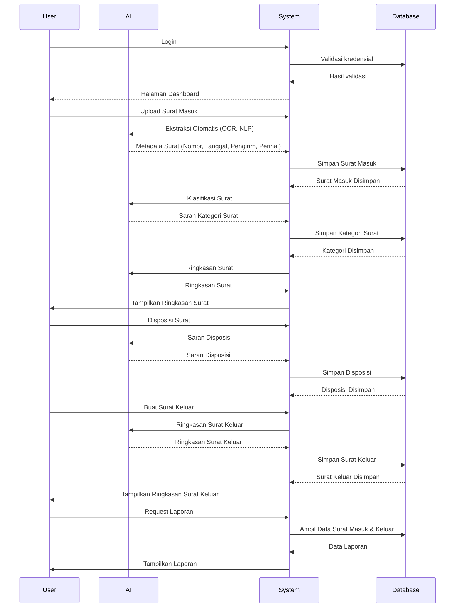
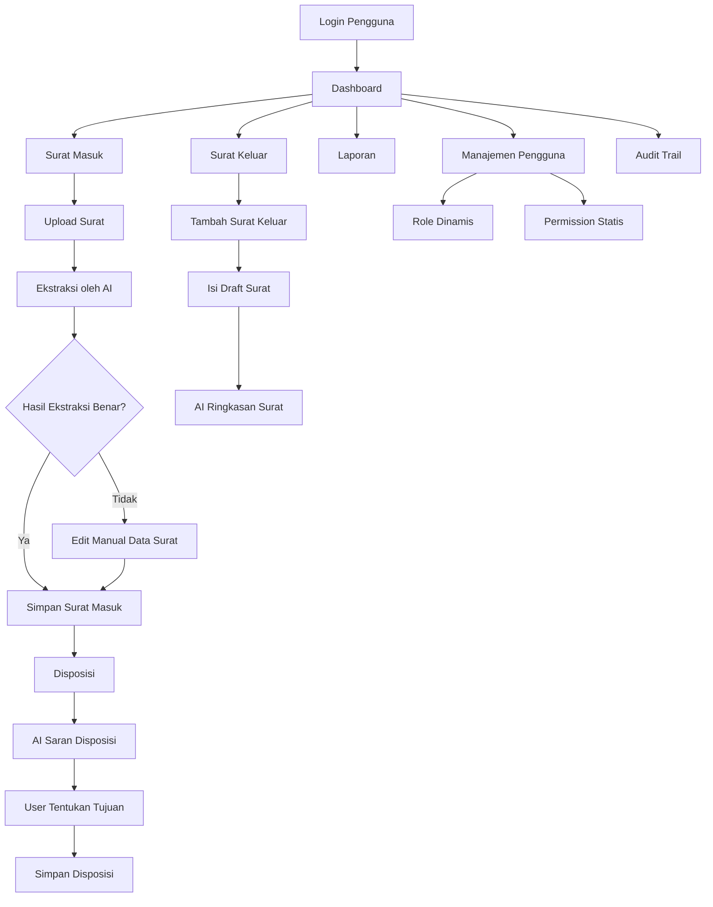

<div align="center">
    <a href="https://404notfound.fun" target="_blank">
        
    </a>
</div>

# Triton - Aplikasi Manajemen Surat

## Deskripsi Produk
Triton adalah aplikasi berbasis web untuk mengelola surat masuk dan keluar, dilengkapi dengan fitur AI untuk ekstraksi data otomatis, klasifikasi isi, ringkasan, dan saran disposisi. Aplikasi ini dibangun menggunakan Laravel di sisi backend dan Vue.js di sisi frontend.

## Tujuan
- Meningkatkan efisiensi dan akurasi dalam pengelolaan surat.
- Mengurangi beban input manual dengan bantuan AI.
- Menyediakan sistem manajemen disposisi yang terorganisir.

## Fitur Utama

### 📥 Surat Masuk
- Upload dokumen (PDF, JPG, PNG).
- **Ekstraksi Otomatis oleh AI**: Isi metadata surat (nomor, tanggal, pengirim, perihal).
- **Klasifikasi Surat Otomatis**: AI menyarankan kategori surat.
- **Ringkasan Surat Otomatis**: Ditampilkan untuk pratinjau cepat.
- Disposisi saran dari AI.
- Riwayat dan status surat terpantau.

### 📤 Surat Keluar
- Pembuatan draft dan unggah dokumen.
- Penomoran otomatis.
- **AI Ringkasan Surat** untuk efisiensi review.

### 🔄 Disposisi
- Disposisi ke pengguna lain.
- AI memberikan **saran disposisi** berdasarkan isi surat.
- Riwayat dan pelacakan proses.

### 📁 Kategori Surat
- AI menyarankan kategori saat input surat.

### 👤 Manajemen Pengguna
- CRUD pengguna dan pengaturan role.
- Role bersifat **dinamis** (bisa ditambah/ubah).
- Permission bersifat **statis**, digunakan di `Gate` Laravel.

### 🔐 Role & Permission
- Role dapat dikonfigurasi admin.
- Permission statis dan digunakan untuk kontrol akses (Gate di Laravel, directive di Vue).

### 🔍 Pencarian & Filter
- Pencarian berdasarkan metadata dan isi surat.
- Filter berdasarkan tanggal, perihal, dan status.

### 📊 Laporan
- Export CSV untuk surat masuk & keluar.
- Disertai filter berdasarkan waktu, perihal, dan status.

## Fitur AI Detail

| Fitur AI                     | Penjelasan                                                               |
|-----------------------------|--------------------------------------------------------------------------|
| **Ekstraksi Data Otomatis** | OCR + NLP untuk mengisi metadata surat secara otomatis.                  |
| **Klasifikasi Surat**        | AI menyarankan kategori surat berdasarkan konten.                       |
| **Ringkasan Surat**          | AI membuat ringkasan pendek isi surat untuk efisiensi pembacaan.         |
| **Saran Disposisi**          | Berdasarkan isi surat, AI menyarankan disposisi. |

## Alur Integrasi AI

1. **Saat Upload Surat Masuk**  
   → Jalankan proses ekstraksi → Klasifikasi → Ringkasan.

2. **Saat Disposisi Surat**  
   → AI menyarankan penerima berdasarkan isi.

3. **Saat Review Surat Keluar**  
   → Ringkasan AI membantu reviewer membaca cepat.

## Sequence Flow



### Penjelasan:
- **User** melakukan login ke aplikasi dan mengakses halaman **Dashboard** setelah kredensial tervalidasi.
- **User** meng-upload **Surat Masuk**, yang diproses oleh **AI** untuk ekstraksi metadata, klasifikasi, dan ringkasan surat.
- **System** menyimpan data surat dan kategori ke dalam **Database**.
- **User** dapat melakukan disposisi surat, dengan bantuan **AI** yang memberikan saran disposisi.
- **User** dapat membuat **Surat Keluar**, yang juga akan diproses oleh **AI** untuk menghasilkan ringkasan surat.
- **User** dapat meminta laporan terkait surat masuk dan keluar, yang akan diambil dari **Database** dan ditampilkan oleh **System**.

## Flow Aplikasi



## Teknologi

- **Laravel 12** – Backend API
- **Vue 3 + Vite** – Reactive frontend
- **Tailwind CSS** – Utility-first CSS framework
- **MySQL** – Relational database

## 🐳 Docker

### Env
Buka file `.env.docker` dan cukup isi data yang kosong
```
GEMINI_API_KEY=
MAIL_MAILER=
MAIL_SCHEME=
MAIL_HOST=
MAIL_PORT=
MAIL_USERNAME=
MAIL_PASSWORD=
```

### Compose

__Cukup dijalankan saat pertama kali!__ Perintah ini digunakan untuk build

```shell
docker compose up -d --build
```
Untuk seterusnya gunakan perintah berikut untuk menjalankan

```shell
docker compose up -d
```

Akses `http://localhost` di browser untuk melihat hasilnya.

## Instal Manual

```bash
# Install PHP dependencies
composer install

# Copy environment file and generate app key
cp .env.example .env
php artisan key:generate
```

### Env
Buka file `.env`
```
DB_DATABASE=your_db
DB_USERNAME=your_user
DB_PASSWORD=your_password
GEMINI_API_KEY=
```

### ▶️ Menjalankan

```bash
# Run migrations
php artisan migrate --seed

# Instal💻l frontend dependencies
npm install
```

Jalankan ketiga perintah ini di terminal masing-masing dan jangan sampai prosesnya mati.
```bash
php artisan serve
php artisan queue:work
npm run dev
```

## 🧑‍💻 Akses Login

- email: `iqbaleff214@gmail.com`
- password: `password`

## 📸 Screenshot


## 📄 License

This project is proprietary software.  
© 2025 [404NotFoundIndonesia](https://github.com/404NotFoundIndonesia) – All rights reserved.  
Use of this software is governed by the [Triton Software License Agreement](LICENSE).